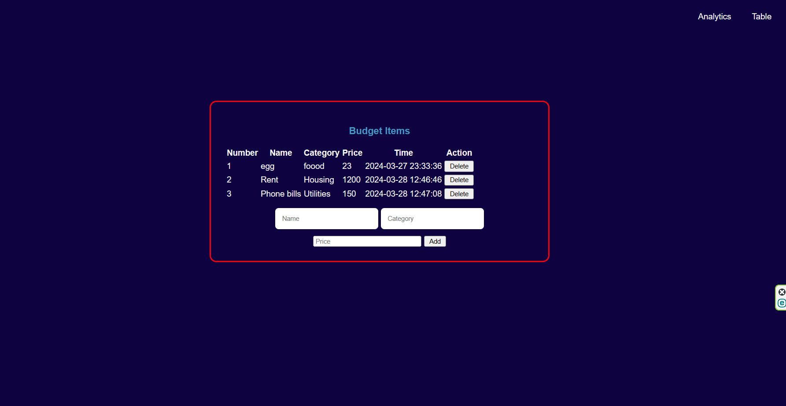

# Budget Planner




## Overview
The Budget Planner is a web application designed to help users manage their finances effectively. It provides features for logging in, viewing a budget table, and under construction analytics functionality for deeper insights.

## Features
- **User Authentication**: Secure login system for user access.
- **Budget Table**: Interactive table for adding and deleting budget items.
- **Analytics (Under Construction)**: Future functionality for analyzing budget data.

## Technologies Used
- **Flask**: Python-based web framework for backend development.
- **HTML**: Markup language for creating the structure of web pages.
- **CSS**: Styling language to enhance the visual presentation.
- **JavaScript (Client-Side)**: Enhances interactivity and dynamic behavior in the browser.
- **JSON**: Data interchange format for storing and transmitting data.

## Screenshots
### Login Screen


### Table View


## Usage
1. Clone the repository:

   ```
   git clone https://github.com/your-username/budget-planner.git
   ```

2. Run the application:

   ```
   python app.py
   ```

3. Access the application in your web browser at `http://localhost:5000`.
